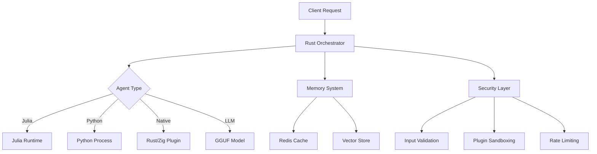

# 🚀 Acropolis

[](https://github.com/Acropolis/core/actions/workflows/ci.yml)
[](https://github.com/Acropolis/core/actions/workflows/security.yml)
[](https://codecov.io/gh/Acropolis/core)
[](https://opensource.org/licenses/MIT)

> **A secure, polyglot, enterprise-ready AI orchestration platform**

The Acropolis is an adaptive expert platform with a modern, multi-language AI agent orchestrator built in Rust. It provides secure, scalable execution of specialized "expert" agents written in the optimal language for each task (Rust, Julia, Zig, Python, WebAssembly).

## ✨ Features

### 🔒 **Enterprise Security**

- **Memory-safe architecture** with comprehensive input validation
- **Plugin sandboxing** with signature verification and allowlisting
- **Julia code execution sandbox** preventing arbitrary code execution
- **Comprehensive security scanning** in CI/CD pipeline
- **Non-root container execution** with minimal attack surface

### 🏗️ **Polyglot Architecture**

- **Rust orchestrator** for high-performance coordination
- **Julia agents** for scientific computing and ML
- **Python integration** for data processing and tooling
- **Zig FFI** for system-level operations
- **WebAssembly plugins** for portable, sandboxed execution

### ⚡ **Performance & Scalability**

- **Async/await** throughout with Tokio runtime
- **Concurrent task execution** with configurable limits
- **Hot plugin reloading** with zero-downtime updates
- **Redis-backed caching** for distributed deployments
- **Resource management** with timeouts and circuit breakers

### 🔍 **Observability**

- **OpenTelemetry integration** for distributed tracing
- **Structured logging** with multiple output formats
- **Performance metrics** and health checks
- **Comprehensive error handling** with contextual information

### 🧪 **Testing & Quality**

- **>90% test coverage** with unit, integration, and property-based tests
- **Fuzz testing** for security-critical components
- **Performance benchmarks** with regression detection
- **Automated security scanning** with dependency vulnerability checks

## 🚀 Quick Start

### Prerequisites

- **Rust** 1.70+ with `cargo`
- **Julia** 1.9+ (for Julia agents)
- **Python** 3.8+ (for Python tools)
- **Docker** (optional, for containerized deployment)

### Installation

#### From Source

```bash
git clone https://github.com/Acropolis/core.git
cd core
cargo build --release --all-features
./target/release/acropolis-cli --help
```

#### Using Docker

```bash
docker run -it ghcr.io/Acropolis/adaptive-expert-platform:latest --help
```

#### Pre-built Binaries

Download from the [releases page](https://github.com/Acropolis/core/releases).

## 📖 Usage

### Basic Server Mode

```bash
# Start the server
acropolis-cli serve --addr 0.0.0.0:8080

# Health check
curl http://localhost:8080/health
```

### Batch Processing

```bash
# Run a batch job from configuration
acropolis-cli run --cfg configs/example_batch.toml
```

### Configuration

The platform uses TOML configuration with environment variable overrides:

```toml
# config.toml
[logging]
log_level = "info"
log_format = "json"

[server]
host = "127.0.0.1"
port = 8080
max_connections = 1000

[security]
enable_plugin_signatures = true
max_request_size_mb = 10
rate_limit_per_minute = 1000

[plugins]
native_directory = "plugins/"
auto_reload = true
max_plugin_size_mb = 50

[memory]
provider = "redis"  # or "in_memory"
url = "redis://localhost:6379"
cache_size = 10000
```

Environment variable overrides use the `AEP_` prefix:

```bash
export AEP_LOGGING__LOG_LEVEL=debug
export AEP_SERVER__PORT=9090
export AEP_SECURITY__ENABLE_PLUGIN_SIGNATURES=false
```

## 🏗️ Architecture

### System Overview



### Key Components

- **Orchestrator**: Central coordination hub managing agent execution
- **Memory System**: Vector storage with embedding caching and KV store
- **Plugin System**: Secure loading and execution of native and WASM plugins
- **Security Layer**: Input validation, sandboxing, and access control
- **Observability**: Metrics, tracing, and health monitoring

For detailed architecture documentation, see [ARCHITECTURE.md](ARCHITECTURE.md).

## 🔒 Security

### 🛡️ **Enterprise-Grade Security Features**

#### **Authentication & Authorization**

- **JWT-based Authentication**: Secure token-based authentication with configurable expiry
- **Role-based Access Control (RBAC)**: Fine-grained permissions system
- **Secure Password Hashing**: Argon2 password hashing with salt
- **Account Security**: Configurable login attempts, account lockout, session timeouts
- **Default Admin Account**: `admin/admin123` (⚠️ **CHANGE IN PRODUCTION**)

#### **Input Validation & Rate Limiting**

- **Comprehensive Input Validation**: All inputs validated against strict schemas
- **Request Size Limits**: Configurable payload size restrictions (default: 5MB)
- **Advanced Rate Limiting**: Per-minute request limits with IP-based controls
- **Security Headers**: HSTS, CSP, X-Frame-Options, and more

#### **Plugin Security System**

- **Mandatory Plugin Signatures**: SHA256 hash-based allowlisting (no bypasses in production)
- **Plugin Sandboxing**: Size limits, extension validation, and runtime isolation
- **Hot-reload Security**: Secure plugin updates without system restart
- **Resource Limits**: Memory and execution time constraints

#### **Code Execution Sandbox**

- **Enhanced Julia Sandbox**: Comprehensive AST validation with forbidden function blocking
- **Python Script Isolation**: Process-based execution with resource limits
- **Native Plugin Verification**: Strict signature verification for all native plugins
- **WebAssembly Security**: WASM-based secure execution environment

#### **Network & Infrastructure Security**

- **Restrictive CORS**: Secure cross-origin resource sharing policies
- **Container Hardening**: Non-root execution with minimal attack surface
- **TLS Termination**: HTTPS enforcement with security headers
- **Dependency Scanning**: Continuous vulnerability monitoring

### 🔧 **Security Configuration**

#### **Production Security Setup**

```toml
[security]
# Authentication (REQUIRED)
enable_authentication = true
jwt_secret = "YOUR-256-BIT-SECRET-HERE"  # Use: openssl rand -base64 32
jwt_expiry_hours = 8

# Network Security
enable_cors = false  # Disable unless specifically needed
allowed_origins = ["https://yourdomain.com"]
enable_rate_limiting = true
rate_limit_per_minute = 100

# Plugin Security (CRITICAL)
enable_plugin_signatures = true  # NEVER disable in production
plugin_allowlist_hashes = [
    "a1b2c3d4e5f67890abcdef...",  # Add your plugin SHA256 hashes
    "f6e5d4c3b2a1098765fedc...",
]
max_plugin_size_mb = 10

# Resource Protection
enable_resource_limits = true
max_execution_time_seconds = 30
max_memory_mb = 512
max_request_size_mb = 5

# Additional Hardening
enable_security_headers = true
max_login_attempts = 5
lockout_duration_minutes = 15
session_timeout_minutes = 480
```

#### **Environment Variables (Production)**

```bash
# Security Configuration
export AEP_SECURITY__JWT_SECRET="$(openssl rand -base64 32)"
export AEP_SECURITY__ENABLE_AUTHENTICATION=true
export AEP_SECURITY__ALLOWED_ORIGINS='["https://yourdomain.com"]'

# Plugin Security
export AEP_SECURITY__PLUGIN_ALLOWLIST_HASHES='["hash1","hash2"]'

# Network Configuration
export AEP_SERVER__HOST="0.0.0.0"
export AEP_SERVER__PORT=8080

# Database Configuration
export AEP_MEMORY__PROVIDER="redis"
export AEP_MEMORY__URL="redis://redis-server:6379"
```

### 🔐 **Authentication Guide**

#### **1. Initial Setup**

```bash
# Start the server
acropolis-cli serve --config config.toml

# Login with default admin account (CHANGE PASSWORD IMMEDIATELY)
curl -X POST http://localhost:8080/auth/login \
  -H "Content-Type: application/json" \
  -d '{"username": "admin", "password": "admin123"}'
```

#### **2. Create Users**

```bash
# Use the JWT token from login
export JWT_TOKEN="your-jwt-token-here"

# Create a new user
curl -X POST http://localhost:8080/auth/users \
  -H "Authorization: Bearer $JWT_TOKEN" \
  -H "Content-Type: application/json" \
  -d '{
    "username": "operator",
    "password": "secure-password",
    "roles": ["user"]
  }'
```

#### **3. Access Protected Endpoints**

```bash
# Execute agent task (requires authentication)
curl -X POST http://localhost:8080/execute \
  -H "Authorization: Bearer $JWT_TOKEN" \
  -H "Content-Type: application/json" \
  -d '{
    "agent_name": "echo",
    "input": {"message": "Hello, World!"}
  }'
```

### 🚨 **Security Best Practices**

#### **🔴 Critical Actions for Production**

1. **Change Default Credentials**: Replace admin password immediately
2. **Generate Strong JWT Secret**: Use `openssl rand -base64 32`
3. **Configure Plugin Allowlist**: Add SHA256 hashes of all authorized plugins
4. **Enable HTTPS**: Use TLS termination with valid certificates
5. **Restrict CORS Origins**: Limit to specific trusted domains
6. **Monitor Security Logs**: Set up alerting for failed authentication attempts

#### **🟡 Recommended Security Measures**

- **Regular Security Audits**: Run `cargo audit` and dependency scans
- **Plugin Hash Verification**: Generate hashes with `sha256sum plugin.so`
- **Resource Monitoring**: Monitor memory and CPU usage for anomalies
- **Backup & Recovery**: Implement secure backup procedures
- **Network Segmentation**: Deploy in isolated network environments

#### **🟢 Operational Security**

- **Log Analysis**: Monitor for suspicious patterns in security logs
- **Update Management**: Keep dependencies updated with `cargo update`
- **Access Reviews**: Regularly review user accounts and permissions
- **Incident Response**: Have procedures for security incident handling

### 🛠️ **Security Tools & Commands**

#### **Generate Plugin Hash**

```bash
# Calculate SHA256 hash for plugin allowlist
sha256sum plugins/my_plugin.so
```

#### **Generate JWT Secret**

```bash
# Generate secure JWT secret
openssl rand -base64 32
```

#### **Security Audit**

```bash
# Run security audit
cargo audit

# Check for vulnerabilities
cargo deny check
```

### 🚨 **Reporting Security Issues**

**⚠️ DO NOT open public GitHub issues for security vulnerabilities**

**Responsible Disclosure:**

- **Email**: `security@Acropolis.dev`
- **PGP Key**: Available at `https://Acropolis.dev/.well-known/pgp`
- **Response Time**: We aim to respond within 24 hours
- **Disclosure Timeline**: 90 days for coordinated disclosure

**Security Bug Bounty Program**: Contact us for details on our responsible disclosure program.

## 🧪 Development

### Building from Source

```bash
# Clone repository
git clone https://github.com/Acropolis/core.git
cd core

# Install dependencies
./scripts/install-deps.sh

# Build with all features
cargo build --all-features

# Run tests
cargo test --all-features

# Run security checks
cargo audit
cargo clippy -- -D warnings
```

### Testing

```bash
# Unit tests
cargo test --lib

# Integration tests
cargo test --test '*'

# Property-based tests
cargo test --features proptest

# Benchmarks
cargo bench

# Coverage report
cargo llvm-cov --all-features --html
```

### Contributing

1. Fork the repository
2. Create a feature branch (`git checkout -b feature/amazing-feature`)
3. Make your changes with tests
4. Run the full test suite (`./scripts/test-all.sh`)
5. Commit with conventional commits (`git commit -m 'feat: add amazing feature'`)
6. Push to your branch (`git push origin feature/amazing-feature`)
7. Create a Pull Request

See [CONTRIBUTING.md](CONTRIBUTING.md) for detailed guidelines.

## 📊 Performance

### Benchmarks

| Metric | Value | Notes |
|--------|-------|-------|
| Request Throughput | >1000 req/s | Single instance, echo agent |
| Latency P99 | <100ms | Including orchestration overhead |
| Memory Usage | <100MB | Base runtime without models |
| Plugin Load Time | <50ms | Native plugin hot-reload |
| Docker Image Size | <500MB | Optimized multi-stage build |

Run `cargo bench` to execute performance benchmarks on your system.

### Scaling

- **Horizontal**: Deploy multiple instances behind a load balancer
- **Vertical**: Increase `max_concurrent_tasks` and memory limits
- **Caching**: Use Redis for shared state across instances
- **Models**: Distribute large models via shared storage

## 🐳 Docker Deployment

### Production Deployment

```yaml
# docker-compose.yml
version: '3.8'
services:
  acropolis:
    image: ghcr.io/adaptive-expert-platform/adaptive-expert-platform:latest
    ports:
      - "8080:8080"
      - "9090:9090"  # Metrics
    environment:
      - AEP_LOGGING__LOG_LEVEL=info
      - AEP_MEMORY__PROVIDER=redis
      - AEP_MEMORY__URL=redis://redis:6379
    volumes:
      - ./config.toml:/app/config.toml:ro
      - ./plugins:/app/plugins:ro
      - ./models:/app/models:ro
    depends_on:
      - redis
    restart: unless-stopped

  redis:
    image: redis:7-alpine
    volumes:
      - redis_data:/data
    restart: unless-stopped

volumes:
  redis_data:
```

### Health Checks

```bash
# Application health
curl http://localhost:8080/health

# Metrics endpoint
curl http://localhost:9090/metrics

# Readiness probe
curl http://localhost:8080/ready
```

## 🔧 Configuration Reference

### Environment Variables

| Variable | Description | Default |
|----------|-------------|---------|
| `AEP_LOGGING__LOG_LEVEL` | Log level (debug, info, warn, error) | `info` |
| `AEP_SERVER__PORT` | Server port | `8080` |
| `AEP_SECURITY__ENABLE_PLUGIN_SIGNATURES` | Enable plugin verification | `true` |
| `AEP_MEMORY__PROVIDER` | Memory backend (in_memory, redis) | `in_memory` |
| `AEP_MEMORY__URL` | Redis connection string | None |
| `AEP_PLUGIN_DIR` | Plugin directory path | `plugins/` |
| `AEP_OTLP_ENDPOINT` | OpenTelemetry endpoint | None |

### File Locations

- **Config**: `./config.toml` or `./adaptive_expert_platform/config.toml`
- **Plugins**: `./plugins/` (configurable)
- **Models**: `./models/` (configurable)
- **Logs**: stdout/stderr or configured file

## 🚨 Troubleshooting

### Common Issues

#### Plugin Loading Failures

```
Error: Plugin not in security allowlist
```

**Solution**: Add plugin hash to `plugin_allowlist_hashes` or disable signature verification for development.

#### Julia Runtime Errors

```
Error: Julia runtime initialization failed
```

**Solution**: Ensure Julia 1.9+ is installed and `JULIA_DIR` environment variable is set.

#### Memory Issues

```
Error: Memory at capacity, removing oldest fragment
```

**Solution**: Increase `max_fragments` or configure Redis for distributed caching.

#### Container Permission Issues

```
Error: Permission denied accessing /app/plugins
```

**Solution**: Ensure volumes are mounted with correct permissions for the `acropolis` user (UID 1000).

### Debug Mode

Enable debug logging:

```bash
export RUST_LOG=debug
export AEP_LOGGING__LOG_LEVEL=debug
acropolis-cli serve
```

### Getting Help

- 📖 **Documentation**: [docs.Acropolis.dev](https://docs.adaptive-expert-platform.dev)
- 💬 **Discord**: [discord.gg/Acropolis](https://discord.gg/adaptive-expert-platform)
- 🐛 **Issues**: [GitHub Issues](https://github.com/Acropolis/core/issues)
- 📧 **Email**: `support@Acropolis.dev`

## 📄 License

This project is licensed under the MIT License - see the [LICENSE](LICENSE) file for details.

## 🙏 Acknowledgments

- **Rust Community** for the amazing ecosystem
- **Julia Language** for scientific computing capabilities
- **Zig** for systems programming excellence
- **Tokio** for async runtime
- **OpenTelemetry** for observability standards

---

<div align="center">
  <p><strong>Built with ❤️ by the Adaptive Expert Platform Team</strong></p>
  <p>
    <a href="https://Acropolis.dev">Website</a> •
    <a href="https://docs.Acropolis.dev">Documentation</a> •
    <a href="https://github.com/Acropolis/core/releases">Releases</a>
  </p>
</div>
